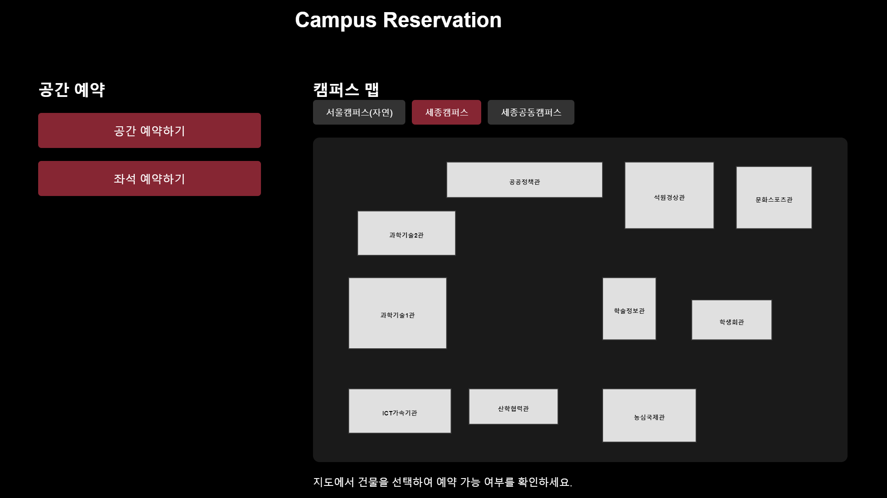

# 대학 캠퍼스 공간 및 좌석 예약 시스템
#### 242R 웹프로그래밍 팀 프로젝트  무엇을 예약해드릴까요? 

대학 캠퍼스 내에서 학생과 교직원이 강의실 및 다양한 학습 공간을 보다 효율적으로 활용할 수 있도록 지원하는 **온라인 공간 및 좌석 예약 시스템**을 제공합니다.

---
## 📌 프로젝트 소개

캠퍼스 내 공간의 효율적 이용은 학생들의 학습 환경 개선과 자원 최적화에 필수적입니다. 그러나 제한된 공간을 공평하고 체계적으로 관리하는 데에는 여러 어려움이 있습니다. 이러한 문제를 해결하기 위해 이 웹사이트는 누구나 쉽게 접근할 수 있는 **직관적인 인터페이스**를 통해 공간 및 좌석 예약을 신속하고 정확하게 할 수 있도록 설계되었습니다.

  <b> 홈페이지 미리보기 </b>  

  

---

## 🛠 주요 기능

- **공간 예약**
  - 강의실을 시간 단위로 예약할 수 있습니다.
- **좌석 예약**
  - 강의실 내 좌석을 개별적으로 선택하여 예약할 수 있습니다.
- **실시간 예약 현황 확인**
  - 특정 강의실의 사용 가능 여부와 예약 현황을 실시간으로 확인하고 관리할 수 있습니다.
- **공정한 자원 배분**
  - 캠퍼스 내 공간 자원의 가시성을 향상시켜 누구나 예약 가능 여부를 투명하게 확인하고 사용할 수 있습니다.
- **예약 관리**
  - 예약 내역을 관리 페이지에서 한눈에 확인하고 수정 및 취소할 수 있어 사용자에게 편리함을 제공합니다.

---

## 🎨 사용자 경험 (UI/UX)

이 웹사이트는 사용자 친화적인 UI/UX를 고려하여 설계되었습니다.

1. **사이트 접속**
   - 사이트에 접속하면 사용자에게 사이트의 목적과 주요 기능을 소개합니다.
2. **로그인**
   - 로그인 기능을 통해 개별 계정으로 예약 서비스를 이용할 수 있습니다.
3. **메인 화면**
   - 로그인 후 메인 화면에서 사용자에게 공간 예약과 좌석 예약 중 하나를 선택할 수 있는 옵션이 제공됩니다.
4. **캠퍼스 맵**
   - 캠퍼스 맵을 통해 건물 위치와 예약 가능 여부를 직관적으로 확인할 수 있습니다.
5. **예약 페이지**
   - **공간 예약**: 강의실을 시간 단위로 예약합니다.
   - **좌석 예약**: 강의실 내 좌석을 개별적으로 선택하여 예약합니다.
6. **관리 페이지**
   - 모든 예약 내역을 한눈에 확인하고 수정 및 취소할 수 있어 예약 관리가 편리합니다.

---

## 🎯 목표

이 웹사이트는 **예약 및 관리 시스템**을 통해 효율적이고 체계적인 공간 운영을 가능하게 하며, 보다 나은 캠퍼스 생활과 학습 환경을 지원하는 것을 목표로 합니다.

---